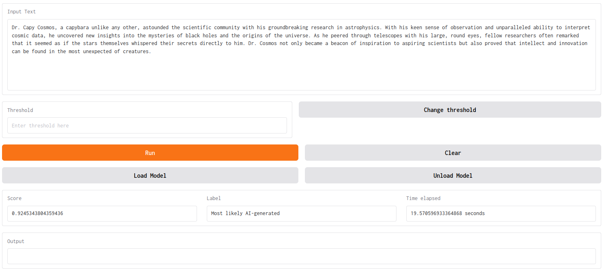

# **CPU Inference of Binoculars (Zero-Shot Detection of LLM-Generated Text)**

This project adapts the [Binoculars](https://github.com/ahans30/Binoculars) code, which it heavily rely on, to run efficiently on CPUs by leveraging smaller language models for both the observer and reference models. Specifically, it uses the [`SmolLM2-135M`](https://huggingface.co/HuggingFaceTB/SmolLM2-135M) language model.

See the original paper : [Spotting LLMs With Binoculars: Zero-Shot Detection of Machine-Generated Text](https://arxiv.org/abs/2401.12070).

---

## **Performance**

- **Accuracy**: On the `datasets` benchmark, we achieve **85% accuracy** with `SmolLM2-135M`.
- **Throughput**:
  - **HuggingFace free CPU Basic (2 vCPU x 16GB RAM)**: ~170 tokens/second (5.9 seconds for 1,000 tokens).
  - **Consumer-grade CPU (16GB RAM)**: ~10 tokens/second (1 minute 30 seconds for 1,000 tokens).

---

## **Installation**

### **Local Setup**

1. **Build and Run the Docker Container**:
   ```bash
   docker compose build
   docker compose up
   ```

2. **Access the Gradio App**:
   Navigate to `http://127.0.0.1:7860` in your web browser to access the app (`app.py`).

   

   - The app allows you to **load/unload the model** dynamically. This is useful when running on GPUs, as it avoids creating multiple GPU instances requiring more VRAM.

3. **Run Binoculars Directly**:
   ```bash
   docker compose exec binoculars bash -c "python3.10 main.py"
   ```

   - You can enforce CPU usage by setting the `BINOCULARS_FORCE_TO_CPU` environment variable.

4. **Important Note**:
   Always use `python3.10` for running Binoculars-related scripts (e.g., `main.py`) on Ubuntu 22.04. Avoid using the default `python` binary.

### **Hugging Face Deployment**

1. Clone this repository to your HuggingFace Space.
2. Rebuild the app within HuggingFace.
3. The application will run on the `CPU Basic` free hardware tier.

---

## **Model Customization**

To change the models:

1. **Observer and Reference Models**:
   Update the models in `detector.py`. The default configuration uses the same model (and tokenizer) for both observer and reference, with the instruct version of the model used for the reference.

2. **Update the Threshold**:
   Adjust the `BINOCULARS_THRESHOLD` in `detector.py`. This threshold is tied to the specific models used and affects performance:
   - You can use the simple `threshold_finder.py` script to calculate an optimal threshold. This script analyzes the original Binoculars datasets, minimizing mismatches between target class and prediction using MSE loss with a sigmoid function for soft (differentiable) ranking.
   - The `threshold_finder.py` script requires `.csv` files generated by `experiments/jobs.sh`.

3. For simplicity, the code employs a single threshold for high accuracy. However, the original Binoculars paper recommends using two thresholds for optimizing either low false positive rates or high accuracy.

---

## **Usage Notes**

- When initializing models, you may encounter the following warning:
  ```
  Some weights of LlamaForCausalLM were not initialized from the model checkpoint at HuggingFaceTB/SmolLM2-135M and are newly initialized.
  ```
  This message is safe to **ignore**. It does not impact the model's runtime or accuracy ([see here](https://huggingface.co/LeoLM/leo-hessianai-13b-chat/discussions/3), [and there](https://huggingface.co/codellama/CodeLlama-7b-hf/discussions/1)).

- **Performance Optimization**:
  - Ensure the `BINOCULARS_FORCE_TO_CPU` environment variable is set for CPU-based usage.
  - If running on GPUs, you can unload the Gradio model temporarily to free up VRAM.
