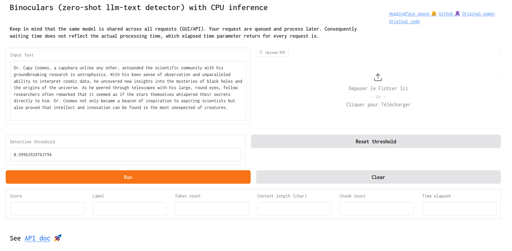

# **CPU Inference of Binoculars (Zero-Shot Detection of LLM-Generated Text)** [[demo]](https://ben-weber-binoculars-cpu.hf.space/app)

This project adapts the [Binoculars](https://github.com/ahans30/Binoculars) code, which it heavily rely on, to run efficiently on CPUs by leveraging smaller language models for both the observer and reference models. Specifically, it uses the [`SmolLM2-135M`](https://huggingface.co/HuggingFaceTB/SmolLM2-135M) language model.

See the online demo : [here 🚀](https://ben-weber-binoculars-cpu.hf.space/app).




---

The app allow you to run Binoculars with either **raw text** or **pdf**, via **GUI** (`Gradio`) or **API** (`FastAPI`) with token auth.
This code can either be run on CPU, as primarily intended, or GPU.

See the original paper : [Spotting LLMs With Binoculars: Zero-Shot Detection of Machine-Generated Text](https://arxiv.org/abs/2401.12070).

---

## **Performance**

- **Accuracy**: On the `datasets` benchmark, we achieve **85% accuracy** with `SmolLM2-135M`.
- **Throughput**:
  - **HuggingFace free CPU Basic (2 vCPU x 16GB RAM)**: ~170 tokens/second (5.9 seconds for 1,000 tokens).
  - **Consumer-grade CPU 4x2.60GHz (16GB RAM)**: ~10 tokens/second (1 minute 30 seconds for 1,000 tokens).

In fact, this code does not requires 16GB of RAM but consumes around 3GB.

---

## **Installation**

### **Local Setup**

1. **Build and Run the Docker Container**:
   ```bash
   docker compose build
   docker compose up
   ```

2. **Access the app**:
   - Navigate to `http://127.0.0.1:7860` in your web browser to access the app (define in `app.py`).
   - See the GUI interface at `/app`
   - See the API doc at `/docs`.
     - Default api key is `my_api_key_1`.
     - You can test the API with `client.py` which allow you to run Binoculars either on raw text or with a pdf.
  

   *API Usage example*:

   ```bash
   /predict/ [POST]
   {
      "content": "my text"
   }
   
   >> {
      "score": 0.8846334218978882,
      "class": 0,
      "label": "Most likely AI-generated",
      "total_elapsed_time": 23.35552716255188,
      "total_token_count": 134,
      "content_length": 661,
      "chunk_count": 1,
      "model": {
         "threshold": 0.99963529763794,
         "observer_model": "HuggingFaceTB/SmolLM2-135M",
         "performer_model": "HuggingFaceTB/SmolLM2-135M-Instruct",
      }
   }
   ```
   - Keep in mind that the same instance of Binoculars is being used by all requests (GUI/API) defined in `interface/bino_singleton.py`. In fact instantiating 2 instances of Binoculars will requires 2x more VRAM or CPU usage/Memory.

3. **Run Binoculars Directly**:
   ```bash
   docker compose exec binoculars bash -c "python main.py"
   ```

  You can enforce CPU usage by setting the `BINOCULARS_FORCE_TO_CPU` environment variable.

### **Hugging Face Deployment**

You can directly clone the HuggingFace Space [here](https://huggingface.co/spaces/ben-weber/Binoculars-CPU).

Or you can manually create a new space :

1. Clone this repository to your HuggingFace Space.
2. Rename this `README.md` to `README-doc.md`
3. Rename `README-HuggingFace-Space.md` to `README.md`
4. Rebuild the app within HuggingFace.
5. The application will run on the `CPU Basic` free hardware tier.

You can switch between hardware on HuggingFace to switch from CPU to GPU without impacting the inner working of this code.

If you want to run the application on a private HuggingFace space you can enable the dev mode and make a ssh port forwarding :

```bash
ssh -L 7860:127.0.0.1:7860 username@ssh.hf.space
```

And then go to `127.0.0.1:7860`.

---

## **Model Customization**

To change the models:

1. **Observer and Reference Models**:
   You can change the models (observer/performer) with environment variables `BINOCULARS_OBSERVER_MODEL_NAME` and `BINOCULARS_PERFORMER_MODEL_NAME`. Be aware that the same tokenizer is used for both the model (which are base model and instruct model).

2. **Update the Threshold**:
   Adjust the environment variable `BINOCULARS_THRESHOLD`. This threshold is tied to the specific models used and affects performance:
   - You can use the simple `threshold_finder.py` script to calculate an optimal threshold. This script analyzes the original Binoculars datasets, minimizing mismatches between target class and prediction using MSE loss with a sigmoid function for soft (differentiable) ranking.
   - The `threshold_finder.py` script requires `.csv` files generated by `experiments/jobs.sh`.
   - For simplicity, the code employs a single threshold for high accuracy. However, the original Binoculars paper recommends using two thresholds for optimizing either low false positive rates or high accuracy.

Models used in the original paper were `tiiuae/falcon-7b` and `tiiuae/falcon-7b-instruct`.

---

## **Usage Notes**

- When initializing models, you may encounter the following warning:
  ```
  Some weights of LlamaForCausalLM were not initialized from the model checkpoint at HuggingFaceTB/SmolLM2-135M and are newly initialized.
  ```
  This message is safe to **ignore**. It does not impact the model's runtime or accuracy ([see here](https://huggingface.co/LeoLM/leo-hessianai-13b-chat/discussions/3), [and there](https://huggingface.co/codellama/CodeLlama-7b-hf/discussions/1)).
- When server is started you will see a "spamming" process in the uvicorn log that ping the route home `/`. It's the `init-proc` process of HuggingFace that start the uvicorn process. **It does not affect the sleep timeout of the HuggingFace space. But do not keep an active session open (where user can interact with or the focus tab of a browser)**.
- Each content is split into multiple chunks (defined by the variable `TEXT_SPLIT_CHAR`). Then, each chunk is processed through Binoculars, and the final score is the average of all chunk scores.
